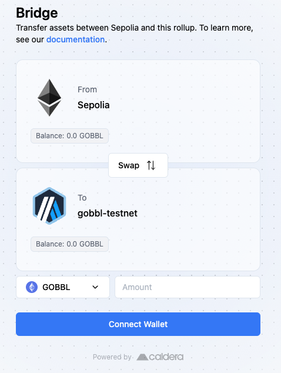

# Bridge Assets to Gobbl

To bridge assets to & from the Gobbl Network: 
1. Navigate to the Gobbl [Bridge Interface](https://gobbl-testnet.bridge.caldera.xyz/)
2. Specify the direction you want the swap to take place
3. Connect your wallet (if necessary)
4. Enter the amount of token that you want to swap 

Afterwards, your funds should be on the way to the desired destination chain!

 