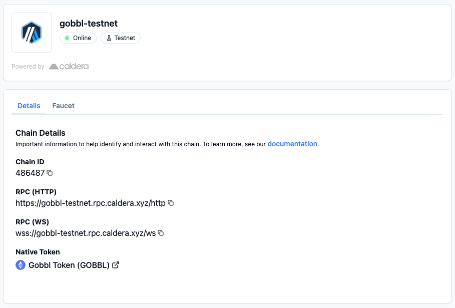

# Add Gobbl Chain to Metamask
## Using the Gobbl Hub Page
1. Navigate to our [Hub Page](https://gobbl-testnet.hub.caldera.xyz/) 
2. Click the 
**Connect** button in the *Your Wallet* section, and you will be prompted to switch to the Gobbl Network

## Manually via Metamask
You can add the network manually via the following details:
- Network Name: Gobbl
- RPC URL: https://gobbl-testnet.rpc.caldera.xyz/http
- Chain ID: 486487
- Currency Symbol: GOBBL
